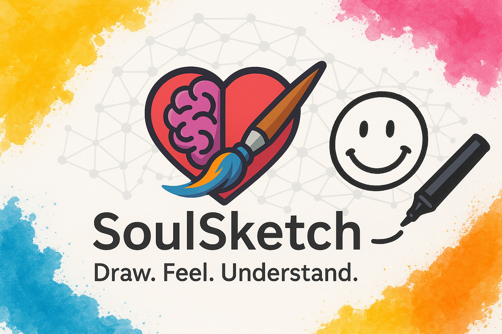
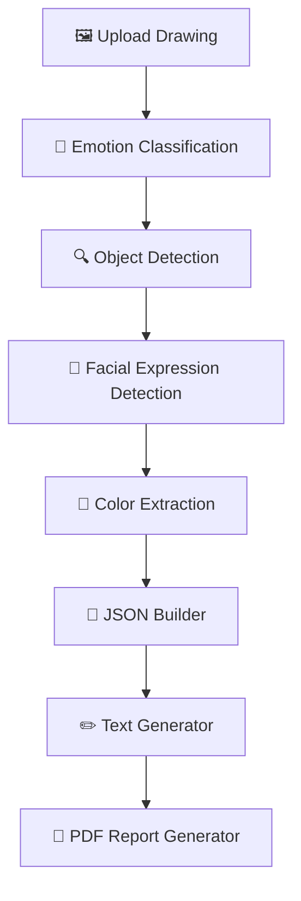
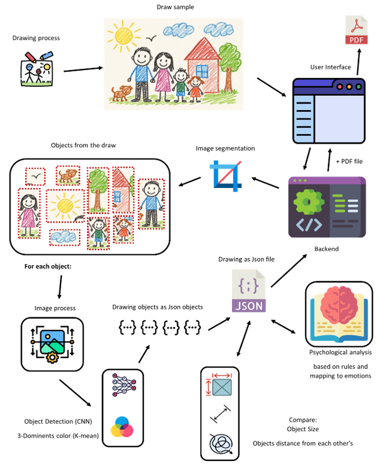
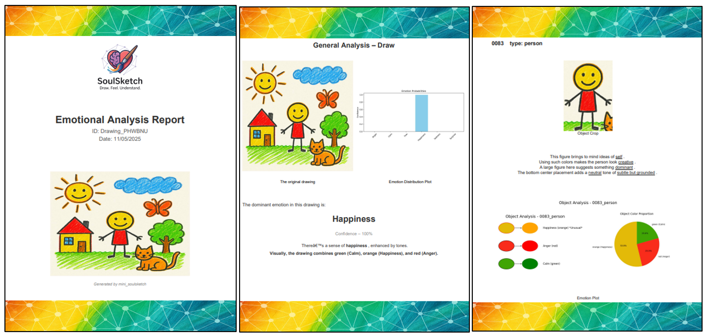

# 🖍️ SoulSketch 🎨
## Emotional Analysis from Children’s Drawings

--- 

### 🙋 Authors & Contact

| Name | GitHub                                      | LinkedIn |
|------|---------------------------------------------|----------|
| Itay Vazana | [Profile](https://github.com/ItayVazana1)   | [LinkedIn Profile](https://www.linkedin.com/in/itayvazana/) |
| Oriya Even Chen | [Profile](https://github.com/oriyaev) | [LinkedIn Profile](https://www.linkedin.com/in/oriyaevenchen/) |

Feel free to reach out regarding academic collaborations, code reuse, or further development ideas.

---

## 📌 Table of Contents

- [🎯 Project Overview](#-project-overview)
- [🧠 Conceptual Motivation](#-conceptual-motivation)
- [🚀 Full System Flow](#-full-system-flow)
- [🔍 Detailed Processing Pipeline](#-detailed-processing-pipeline)
- [📁 Project Directory Structure](#-project-directory-structure)
- [📤 Output Format](#-output-format)
- [🛠️ Technologies Used](#️-technologies-used)
- [🖼️ Report Example](#-visual-previews)
- [📦 How to Run](#-how-to-run)
- [📝 License](#-license)

---

## 🎯 Project Overview

**SoulSketch** is a modular AI pipeline that performs **emotional analysis** on children's hand-drawn images.

It merges techniques from:

- 🧠 **Psychology** (color-emotion mapping, symbolic objects)
- 🖼️ **Computer Vision** (YOLOv8 object detection and classification)
- 🎨 **Color Science** (dominant color extraction and emotional tone mapping)
- 📚 **Natural Language Processing** (template-based emotional narrative generation)
- 📄 **Report Building** (visual and textual PDF construction)

> It transforms a simple uploaded image into a **multi-page PDF** summarizing the emotional insights found in the drawing.



---

## 🧠 Conceptual Motivation

Children often externalize internal emotions through art.  
SoulSketch decodes these emotional traces by analyzing:

- 🎨 **Colors** used and their emotional associations
- 🧍 **Objects** and symbols drawn (e.g., house, person, tree)
- 🙂 **Facial Expressions** present (e.g., angry, sad, hollow eyes)
- 🧩 **Spatial layout** and relative sizes
- 📖 **Scene-wide emotional tone**

It goes beyond classification — generating human-readable explanations in natural language.

---

## 🚀 Full System Flow



Each module operates in sequence and stores its output in `shared_memory/` for the next step.



---

## 🔍 Detailed Processing Pipeline

### 1️⃣ Upload & Input Validation

- ✅ Format: PNG / JPG
- ✅ Resolution: min 128×128
- ✅ Whiteness threshold (removes blank submissions)

➡️ Stored at: `shared_memory/0_BE_input/original_input.png`

---

### 2️⃣ Emotional Classification

- YOLOv8-based classifier for overall emotion
- Enhances contrast, runs model, and creates bar plot

📄 `EC_result.json` + 📊 `emotion_probs_plot.png`  
🗂️ `shared_memory/1_EC_out/`

---

### 3️⃣ Object Detection

- YOLOv11 detection of symbolic objects (e.g. tree, sun)
- Crops taken from original image
- Adds size + grid zone (spatial encoding)
- Filters duplicates with IoU thresholding

🖼️ Crops + metadata + annotated plots  
🗂️ `shared_memory/2_OBJ_DET_out/`

---

### 4️⃣ Facial Expressions Detection

- YOLOv11 trained to detect stylized faces and eyes
- Detects face parts, labels expressions
- Crops + expression distribution charts

📄 `expressions.json` + 📊 histograms  
🗂️ `shared_memory/3_FED_out/`

---

### 5️⃣ Colors Extractor (CEX)

- Uses LAB color space normalization + KMeans clustering
- Maps RGB to emotions using custom rules
- Filters bright/white colors

📄 JSON per entity (drawing, object, face)  
📊 Pie + bar charts per crop  
🗂️ `shared_memory/4_CEX_out/`

---

### 6️⃣ JSON Builder

- Aggregates all outputs into:
  - `pre_analysis.json`: structured object + color + emotion data
  - `post_analysis.json`: same + emotional narrative text

✅ Schema validation with `jsonschema`  
🗂️ `shared_memory/5_JSON_out/`

---

### 7️⃣ Text Generator

- Generates natural descriptions using JSON + templates:
  - Scene summary
  - Object narratives
  - Facial expression context
  - Flattened full paragraph

📄 Output: `analysis_text.json`  
🗂️ `shared_memory/6_AG_out/`

---

### 8️⃣ PDF Report Generator

- Full multi-page report using ReportLab:
  - Cover page
  - Table of Contents
  - Drawing analysis
  - Object insights
  - Expression breakdown
  - Final thank-you

- Auto-compressed with Ghostscript

📄 Final Output: `full_analysis_report.pdf`  
🗂️ `shared_memory/7_PDFG_out/`

---

## 📁 Project Directory Structure

```
Full_Analyze_Flow/
├── emotional_classification/
├── object_detection/
├── facial_expressions_detection/
├── colors_extractor/
├── json_builder/
├── analysis_generator/
├── pdf_generator/
├── backend_app/
├── shared_memory/
├── others/
├── app.py
└── run.bat
```

---

## 📤 Output Format

```
📄 PDF Report: shared_memory/7_PDFG_out/full_analysis_report.pdf
🧾 Logs: shared_memory/0_BE_out/flow_log_*.txt
🗂️ ZIP Archive: includes report + log
```

---

## 🛠️ Technologies Used

| Type        | Libraries                          |
|-------------|-------------------------------------|
| Detection   | `ultralytics`, `opencv-python`      |
| Plots       | `matplotlib`, `Pillow`, `numpy`     |
| NLP         | Template-based generator            |
| PDF         | `reportlab`, `PyPDF2`, `Ghostscript`|
| JSON Tools  | `jsonschema`, `colorama`            |
| ML Support  | `scikit-learn`                      |

---

## 🖼️ Report Example

 

---

## 📦 How to Run

### Using .bat file

Just click on 'run.bat' inside the project root folder.

### 🛠️ using CLI 

Get inside the project root folder in the terminal (CMD)
and then type:
```bash
  streamilt run app.py
```

---

## 📝 License

This repository is for academic/educational purposes only.  
Do not distribute or commercialize without permission.

---
